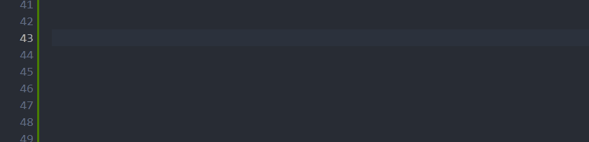

# Log with Emoji - Visual Studio Code 扩展

- [English](./README.md)

## 概述



**Log with Emoji** 是一款适用于 Visual Studio Code 的扩展，它允许您在代码中使用有趣的**随机**表情符号记录消息。通过在您的 console.log 语句或其他自定义日志格式中添加表情符号，它提升了您的开发体验。

## 特点

- **可自定义的表情符号列表**：您可以自定义可用于记录的表情符号列表。添加您喜爱的表情符号，使您的日志更富表现力。

- **快速记录日志**：使用预定义的触发器快速记录消息。例如，输入 "log" 并选择所需的表情符号和日志格式以插入到您的代码中。

## 入门指南

1. **安装**：从 [Visual Studio Code Marketplace](https://marketplace.visualstudio.com/items?itemName=codeColajs.log-with-emoji) 安装该扩展。

2. 表情符号列表：通过修改您的 VS Code 设置中的 logWithEmoji.emojiList 设置，自定义可用的表情符号列表。您可以使用任何您喜欢的表情符号。

## 自定义

### 表情符号列表

您可以自定义可用于记录的表情符号列表。该扩展提供了默认的表情符号列表，但您可以添加自己喜欢的表情符号。在处理列表时，该扩展将自动删除重复的表情符号。

## 示例配置

```json
"logWithEmoji.emojiList": [
  "❤️",
  "🌟",
  "😃",
  "🚀",
  "🎉"
  // 在这里添加您喜爱的表情符号
]
```

## 贡献

如果您有任何建议、错误报告或功能请求，请在 [GitHub 上提出问题](https://github.com/code-cola-js/Log-With-Emoji-VSCode/issues)。我们欢迎社区的贡献！

## 许可证

该扩展采用 [MIT 许可证](LICENSE) 授权。
